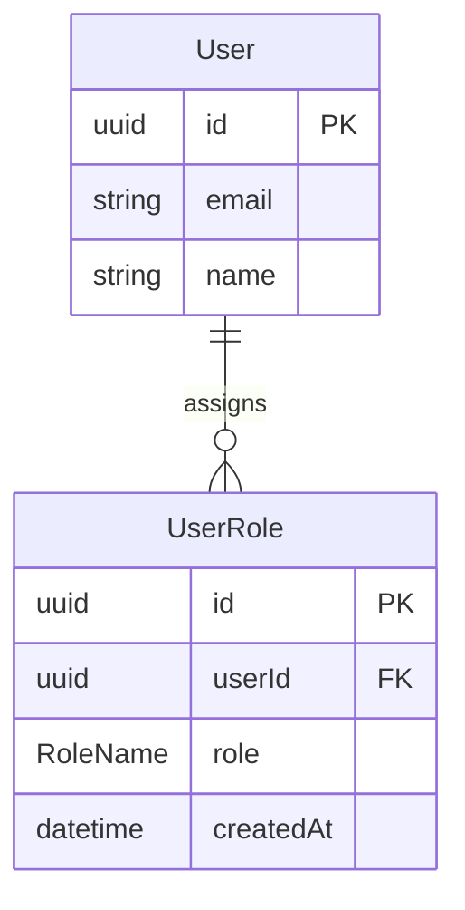
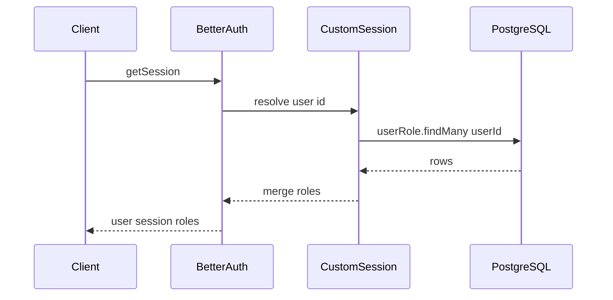

# Roles architecture (Octacard-style)

This document describes a simple multi-role system for a TypeScript application using **Better Auth**, **Prisma / PostgreSQL**, and a **Hono** (or similar) API. The pattern favors a join table and session enrichment over a single `role` string on the user row.

---

## 1. Goals and semantics

- **ADMIN** and **SUPERADMIN** are **equivalent for every access check**: middleware, API handlers, and client UX helpers should treat either role as “admin-capable.”
- **SUPERADMIN** exists in the schema and in bootstrap data (allowlisted signups get **both** ADMIN and SUPERADMIN rows). There is **no** separate “superadmin-only” enforcement layer in this pattern.
- **Security** is enforced on the server. Client-side checks are for navigation and UX only.

---

## 2. Data model (Prisma / PostgreSQL)

- **Users** are normal Better Auth `User` records (standard fields; no reliance on a `role` string column for app authorization in this pattern).
- **Role names** live in a Prisma enum, e.g. `RoleName`:

  ```prisma
  enum RoleName {
    ADMIN
    SUPERADMIN
  }
  ```

- **Assignment** uses a join table `UserRole`:

  - `id` (primary key)
  - `userId` (FK to `User`)
  - `role` (`RoleName`)
  - `createdAt`
  - `@@unique([userId, role])` so each user holds **multiple distinct** roles without duplicate rows
  - `@@index([role])` if you often filter or query by role

**Do not** use a single string column on `User` for these application roles when following this pattern. If you must keep a legacy column temporarily, migrate rows into `UserRole`, backfill, then remove or repurpose the column (e.g. display-only).

---

## 3. Session / JWT surface (Better Auth)

Use Better Auth’s **`customSession`** plugin so that **every session resolution** loads roles from the database:

1. Resolve the session as usual (`session.user.id` / `userId`).
2. `userRole.findMany({ where: { userId } })` (or equivalent).
3. Map to `roles: RoleName[]` (on the wire these are the enum’s **string values**, e.g. `"ADMIN"`).

Merge that into the payload the client receives, for example:

```ts
// Conceptual shape — align with Better Auth customSession API
{ user, session, roles: RoleName[] }
```

See [Better Auth: custom session](https://www.better-auth.com/docs/concepts/session#custom-session) for the exact hook shape in your Better Auth version.

**Important:** After `customSession` is configured, **`auth.api.getSession`** (and the client session hook) should expose the **same enriched object** everywhere—API middleware, SSR, and TanStack Start server functions—so you do not drift between “session-only user” and “user + roles.”

---

## 4. Who gets roles at signup

In **`databaseHooks.user.create.after`**:

1. Normalize `user.email` to lowercase.
2. Parse **`AUTH_SUPERADMIN_EMAILS`** (comma-separated list of lowercase emails).
3. If the user’s email is in that set, insert **both** roles:

   ```ts
   await prisma.userRole.createMany({
     data: [
       { userId: user.id, role: "ADMIN" },
       { userId: user.id, role: "SUPERADMIN" },
     ],
     skipDuplicates: true,
   })
   ```

Use `skipDuplicates: true` so retries or duplicate hook runs do not error.

---

## 5. Operational promotion (CLI)

Provide a small CLI script, e.g. `pnpm run db:make-admin <email-or-name>`:

1. If the argument contains `@`, look up by **email** (trim, lowercase).
2. Otherwise look up by **name** (e.g. case-insensitive `equals`).
3. If no user, exit with a clear error.
4. Promote with:

   ```ts
   await prisma.userRole.createMany({
     data: [
       { userId: user.id, role: RoleName.ADMIN },
       { userId: user.id, role: RoleName.SUPERADMIN },
     ],
     skipDuplicates: true,
   })
   ```

This gives local/staging/production operators a path that does **not** depend only on the env allowlist.

**nwords note:** When wiring this monorepo, import the shared Prisma client from `@nwords/db` and register the script in the root `package.json` if you expose it at the workspace root.

---

## 6. Server authorization (Hono or similar)

**`requireAdmin` middleware** (name as you prefer; behavior below):

1. Resolve the session via `auth.api.getSession({ headers: … })` (or rely on prior middleware that does and attach the same enriched session).
2. Read **`roles`** from the enriched session (same shape as `customSession` output).
3. **401** if there is no authenticated user.
4. **403** if `roles` includes **neither** `"ADMIN"` **nor** `"SUPERADMIN"`.
5. Optionally `c.set("roles", roles)` for downstream handlers.

Mount this middleware on **all sensitive API prefixes**, e.g. `/api/admin/*`.

**Sensitive routes outside `/api/admin/*`** (e.g. aggregation endpoints that behave differently for operators): optionally **re-check the database**:

```ts
await prisma.userRole.findFirst({
  where: {
    userId,
    role: { in: ["ADMIN", "SUPERADMIN"] },
  },
})
```

That avoids relying solely on whatever was serialized in the session payload.

---

## 7. Client authorization (UX only)

- Treat `roles` as `string[]` (or the enum’s string values).
- Expose a small helper, e.g.:

  ```ts
  function isAdminOrSuperadmin(session: { roles?: string[] } | null): boolean {
    const roles = session?.roles ?? []
    return roles.includes("ADMIN") || roles.includes("SUPERADMIN")
  }
  ```

- Use it with **`useSession()`** (or your app’s equivalent) to show admin routes, nav items, and banners.
- **Repeat:** this is **not** security. The API **must** enforce `requireAdmin` (and DB checks where you chose to add them).

---

## 8. Environment / secrets (typical)

| Variable | Purpose |
|----------|---------|
| `BETTER_AUTH_SECRET` | Signing / encryption for Better Auth |
| `BETTER_AUTH_URL` | Base URL for auth callbacks and trusted origins |
| `AUTH_SUPERADMIN_EMAILS` | Optional comma-separated **lowercase** emails that receive ADMIN + SUPERADMIN on **user create** |

---

## 9. Diagrams

### Data model



### Session enrichment flow



---

## 10. This repository today (nwords)

The **nwords** codebase currently uses a **single column** `User.role` in [`packages/db/prisma/schema.prisma`](../../packages/db/prisma/schema.prisma) with enum `USER | ADMIN`. The API loads that field after `getSession` in [`apps/api/src/middleware/auth.ts`](../../apps/api/src/middleware/auth.ts); admin gating uses `user.role === "ADMIN"` in [`apps/api/src/middleware/admin.ts`](../../apps/api/src/middleware/admin.ts), and the web admin layout checks the DB role in [`apps/web/src/routes/_authed/_admin.tsx`](../../apps/web/src/routes/_authed/_admin.tsx). There is **no** `UserRole` table, **no** `SUPERADMIN`, and **no** `customSession` in [`packages/auth/src/server.ts`](../../packages/auth/src/server.ts).

**Adopting this document in nwords** would require: a Prisma migration (enum + `UserRole`, and a strategy for the legacy `role` column), Better Auth `customSession` + optional `databaseHooks`, updating auth middleware and admin checks to use `roles` / `isAdminOrSuperadmin`, and aligning any server functions such as [`apps/web/src/lib/auth-session.ts`](../../apps/web/src/lib/auth-session.ts). None of that is required to **read** or **reuse** this architecture description elsewhere.

---

## Success criteria (for implementers)

- A reader can implement the pattern end-to-end from this document without re-deriving semantics or env behavior.
- **ADMIN** vs **SUPERADMIN** equivalence is explicit in access checks; both unlock the same middleware and UI gates.
